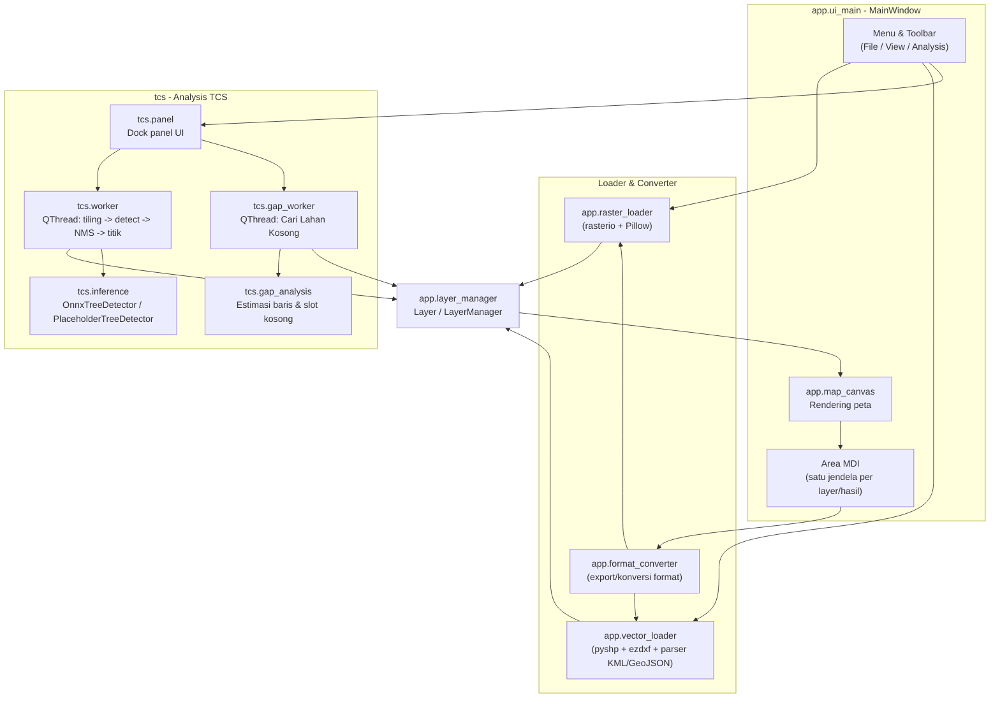
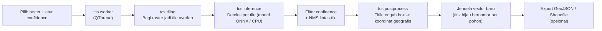

# TCS - Tree Counting Sawit

Aplikasi desktop (Windows) untuk membuka data raster/vector sekaligus menghitung otomatis jumlah pohon sawit dari citra udara/orthophoto, dikembangkan oleh **PT Terramitra Citra Persada**. TCS dibangun di atas viewer raster/vector "Terra View" dengan tambahan modul **Analysis TCS** untuk deteksi dan analisis pohon sawit.

## Daftar Isi

- [Fitur](#fitur)
- [Bahasa dan Teknologi yang Digunakan](#bahasa-dan-teknologi-yang-digunakan)
- [Arsitektur Aplikasi](#arsitektur-aplikasi)
- [Alur Kerja Aplikasi](#alur-kerja-aplikasi)
- [Format Data yang Didukung](#format-data-yang-didukung)
- [Menjalankan dari Source](#menjalankan-dari-source-repo-ini)
- [ECW / GDAL](#ecw--gdal)
- [Build EXE/Installer](#build-exeinstaller-developer-tidak-termasuk-repo-ini)

## Fitur

### Viewer (raster & vector)

| Fitur | Keterangan |
|---|---|
| Open Raster | Membuka GeoTIFF, JPG/PNG (dengan/ tanpa world file), IMG, dan ECW (jika runtime GDAL/ECW tersedia). |
| Open Vector | Membuka Shapefile, GeoJSON, KML/KMZ, dan DXF. |
| Open DEM | Membuka raster elevasi (single-band), ditampilkan sebagai grayscale/color ramp, nilai bisa dibaca lewat klik. |
| Export Raster / Export Vector | Konversi antar format (lihat [Format Data yang Didukung](#format-data-yang-didukung)). |
| Reset / Data Extents, Zoom In/Out, Zoom Box | Navigasi peta standar. |
| Window Link | Menyinkronkan pan/zoom antar jendela peta yang CRS-nya cocok. |
| Metadata / Properties | Info layer aktif (ukuran, CRS, path, jumlah fitur, dsb). |
| MDI Window | Setiap raster/vector yang dibuka tampil di jendela sendiri (minimize/maximize/close), lengkap dengan status bar Lat/Lon. |

### Analysis TCS (menu **Analysis** / grup toolbar **Analysis**)

| Fitur | Keterangan |
|---|---|
| **TCS Panel -> Run Counting** | Mendeteksi dan menghitung pohon sawit secara otomatis dari raster yang dipilih. Selalu memproses seluruh raster (full extent); satu-satunya kontrol yang diekspos ke pengguna adalah slider tingkat keyakinan (*confidence*). Hasilnya dibuka sebagai **jendela vector baru** berisi satu titik per pohon terdeteksi (lingkaran hijau). |
| **Cari Lahan Kosong...** | Langkah opsional setelah Run Counting (tidak wajib, tidak mengubah hasil counting). Mempelajari pola baris tanam dari titik pohon yang sudah terdeteksi (bukan grid tetap), lalu menandai posisi kosong yang seharusnya ada pohon di sepanjang baris tersebut. Hasilnya ditambahkan sebagai silang merah **ke jendela hasil counting yang sama** (bukan jendela/layer baru). |
| **Clear All** | Membersihkan semua layer dan jendela yang terbuka. |

Hasil TCS (titik pohon maupun titik lahan kosong) adalah layer vector titik biasa, sehingga bisa langsung diekspor ke GeoJSON atau Shapefile lewat menu Export yang sama seperti file vector lainnya.

Model deteksi bawaan (`models/*.onnx`) dijalankan lewat `onnxruntime` (CPU-only, ringan, ±15-20 MB) - selalu tersedia begitu dependency ter-install, tanpa perlu setup tambahan, dan tanpa perlu install framework machine learning besar apa pun secara terpisah. Jika file model tidak ditemukan, TCS tetap berjalan memakai *placeholder detector* bawaan (berbasis indeks vegetasi) supaya seluruh alur aplikasi tetap bisa dicoba.

## Bahasa dan Teknologi yang Digunakan

TCS ditulis seluruhnya dalam **Python 3** (dikembangkan/diuji dengan Python 3.11-3.13), dengan pembagian tanggung jawab per pustaka sebagai berikut:

| Pustaka | Peran dalam aplikasi |
|---|---|
| **PyQt6** | Kerangka GUI desktop: jendela utama, menu, toolbar, area MDI (multi-window), dialog, dan canvas rendering peta (`QGraphicsScene`/`QGraphicsView`). |
| **rasterio** | Baca/tulis raster bergeoreferensi (GeoTIFF/IMG, dan cache hasil konversi ECW) - membungkus GDAL untuk mendapatkan geotransform, CRS, dan piksel raster. |
| **pyproj** | Reprojeksi/transformasi koordinat antar CRS (dipakai saat menumpuk layer dengan sistem koordinat berbeda, dan saat membaca/menulis format yang butuh WGS84). |
| **shapely** | Operasi geometri (polygonize hasil segmentasi vegetasi, convex hull, buffer, union) - dipakai baik oleh viewer maupun modul TCS. |
| **numpy** | Komputasi array/matriks untuk pengolahan piksel raster, tiling, dan seluruh matematika deteksi (NMS, indeks vegetasi, estimasi arah baris tanam). |
| **Pillow (PIL)** | Baca/tulis gambar biasa (JPG/PNG tanpa GDAL), serta resize tile citra ke ukuran input model deteksi. |
| **pyshp** | Baca/tulis Shapefile murni Python, tanpa perlu GDAL/Fiona - mengecilkan ukuran instalasi secara signifikan. |
| **ezdxf** | Baca file DXF (CAD) murni Python, tanpa perlu driver GDAL/OGR DXF. |
| **onnxruntime** | Menjalankan model deteksi objek (format ONNX) di CPU untuk modul TCS, tanpa memerlukan framework machine learning berukuran besar saat runtime. |

Alat bantu developer (tidak termasuk di repo ini, lihat [Build EXE/Installer](#build-exeinstaller-developer-tidak-termasuk-repo-ini)): **PyInstaller** (membundel aplikasi Python menjadi EXE mandiri) dan **Inno Setup** (membuat installer Windows).

## Arsitektur Aplikasi

Struktur kode dibagi menjadi dua bagian besar: `app/` (viewer raster/vector generik, warisan dari Terra View) dan `tcs/` (modul Analysis TCS yang berdiri di atas viewer tersebut).

```
TCS_NEW/
├── app/                        # Viewer raster/vector (Terra View)
│   ├── main.py                 # Entry point aplikasi (QApplication + MainWindow)
│   ├── ui_main.py               # MainWindow: menu, toolbar, area MDI, aksi Open/Export/View
│   ├── map_canvas.py             # Rendering peta per jendela (raster + overlay vector, TCS style)
│   ├── layer_manager.py           # Model data Layer + LayerManager (stack layer per jendela)
│   ├── raster_loader.py            # Loader raster: rasterio (GeoTIFF/IMG/ECW) + fallback Pillow (JPG/PNG)
│   ├── vector_loader.py             # Loader vector: pyshp (SHP), ezdxf (DXF), parser KML/GeoJSON bawaan
│   ├── format_converter.py           # Konversi/export raster & vector antar format
│   ├── coordinate_tools.py            # Transformasi pixel<->world, lat/lon untuk status bar
│   ├── image_enhancement.py            # Penyesuaian tampilan raster (stretch, uint8 RGB)
│   ├── gdal_runtime_dialog.py            # Dialog pencarian/pemilihan runtime GDAL untuk ECW
│   ├── export_tools.py                    # Helper dialog Save As untuk export
│   ├── promo_dialog.py                     # Popup promosi PT Terramitra Citra Persada
│   └── resources.py                         # Resolusi path asset - konsisten baik dijalankan dari
│                                               source maupun sebagai EXE hasil PyInstaller
│
└── tcs/                        # Modul Analysis TCS (deteksi & hitung pohon sawit)
    ├── panel.py                 # Dock panel UI: pilih raster, slider confidence, tombol Run/Cari Lahan Kosong
    ├── config.py                 # Nilai default (ukuran tile, confidence, IoU, dsb.)
    ├── tiling.py                  # Membagi raster besar menjadi tile-tile yang saling overlap
    ├── inference.py                # Abstraksi TreeDetector + backend OnnxTreeDetector & PlaceholderTreeDetector
    ├── model_registry.py            # Menemukan model *.onnx yang dibundel + memilih yang paling akurat
    ├── worker.py                     # QThread: pipeline tiling -> deteksi -> filter/NMS -> titik geografis
    ├── postprocess.py                 # NMS lintas-tile, konversi bbox -> titik ber-georeferensi, simpan hasil
    ├── gap_analysis.py                 # Algoritma "Cari Lahan Kosong" berbasis pola baris tanam
    └── gap_worker.py                    # QThread pembungkus gap_analysis agar UI tidak freeze
```

### Model data (`app/layer_manager.py`)

Setiap data yang terbuka - raster, DEM, atau vector - direpresentasikan sebagai satu objek `Layer` (dataclass) yang menyimpan: tipe layer, path sumber, data piksel/geometry, `transform` (geotransform) dan `crs`, serta metadata tampilan (visibility, opacity). `LayerManager` menyimpan stack `Layer` per jendela MDI dan menentukan raster mana yang jadi "base" saat vector lain ditumpuk di atasnya. Desain ini sengaja dibuat ringan dan tidak tergantung UI, sehingga loader, exporter, dan modul TCS semuanya berbicara lewat model data yang sama.

### Diagram arsitektur modul



## Alur Kerja Aplikasi

### 1. Alur pengguna: membuka & melihat data

1. Pengguna membuka raster (`File > Open Raster...`) dan/atau vector (`File > Open Vector...`).
2. `raster_loader`/`vector_loader` membaca file, mengekstrak geometry/piksel beserta `transform` dan `crs`-nya, lalu membungkusnya menjadi objek `Layer`.
3. `layer_manager` menambahkan `Layer` tersebut ke jendela MDI baru; `map_canvas` merender layer itu (raster sebagai gambar, vector sebagai outline/marker).
4. Pengguna dapat menumpuk vector di atas raster (jika CRS-nya cocok), memakai Window Link untuk menyinkronkan tampilan antar jendela, melihat Metadata/Properties, atau meng-export ulang ke format lain.

### 2. Alur proses TCS: deteksi & hitung pohon sawit

Dipicu dari **Analysis > TCS Panel > Run Counting**:



Detail tiap tahap:

1. **Tiling** - raster besar dibagi menjadi tile-tile berukuran tetap yang saling tumpang-tindih (overlap), agar pohon yang terpotong di batas tile tidak hilang dari deteksi.
2. **Deteksi per tile** - setiap tile diproses oleh model deteksi bawaan (format ONNX, dijalankan lewat `onnxruntime`) yang menghasilkan kandidat kotak deteksi beserta skor keyakinannya. Jika file model tidak tersedia, dipakai *placeholder detector* berbasis indeks vegetasi (Excess Green Index + threshold otomatis) sebagai gantinya.
3. **Filter + NMS lintas-tile** - kandidat dengan skor di bawah ambang confidence dibuang; sisanya disaring dengan *Non-Maximum Suppression* lintas-tile agar satu pohon yang terdeteksi di dua tile bertetangga (area overlap) tidak dihitung dua kali.
4. **Konversi ke titik geografis** - titik tengah setiap kotak deteksi yang tersisa dikonversi dari koordinat piksel ke koordinat dunia nyata memakai geotransform raster, menghasilkan satu titik per pohon.
5. Hasilnya dibuka sebagai **jendela vector baru** (bukan ditumpuk ke raster) berisi marker lingkaran hijau, dan siap diekspor.

### 3. Alur opsional: Cari Lahan Kosong

Dipicu setelah Run Counting selesai, lewat tombol **Cari Lahan Kosong...** di panel yang sama:

1. Sistem mengambil semua titik pohon yang baru terdeteksi, lalu mengestimasi **arah baris tanam dominan** dari histogram arah tetangga terdekat antar pohon.
2. Titik-titik pohon diputar sehingga baris tanam menjadi horizontal, kemudian dikelompokkan ke barisnya masing-masing.
3. Untuk setiap baris, sistem mengestimasi **jarak tanam median** antar pohon lalu menyusuri baris tersebut dari pohon pertama sampai terakhir pada jarak itu - posisi yang seharusnya ada pohon tapi tidak ditemukan menjadi kandidat "lahan kosong".
4. Kandidat yang terlalu dekat dengan pohon asli, berada di luar area kerja (polygon batas lahan pilihan pengguna, atau convex hull dari titik pohon jika tidak ada polygon batas), atau terlalu dekat tepi raster, dibuang.
5. Kandidat yang tersisa ditambahkan sebagai **silang merah ke jendela hasil counting yang sama** (bukan jendela/layer baru), lalu jendela tersebut digambar ulang.

Pendekatan ini sengaja mengikuti pola baris tanam sesungguhnya (bukan grid abstrak berjarak tetap), sehingga cocok untuk lahan yang tidak sepenuhnya rata/lurus, dan sudah divalidasi memakai data sintetis (baris pohon yang diputar dengan beberapa pohon dihilangkan secara sengaja) - hasilnya menemukan kembali posisi pohon yang dihilangkan secara tepat.

## Format Data yang Didukung

| Format | Baca | Tulis/Export | Catatan |
|---|---|---|---|
| GeoTIFF (.tif/.tiff) | Ya | Ya | Lewat rasterio/GDAL, CRS & geotransform terbaca penuh. |
| JPG / PNG | Ya | Ya | Lewat Pillow jika tanpa info raster; georeferensi terbaca dari world file (`.jgw/.pgw/.tfw`) dan/atau file `.prj` pendamping jika ada. |
| IMG / ECW | Ya (baca) | - | Butuh runtime GDAL dengan driver ECW, lihat [ECW / GDAL](#ecw--gdal). |
| Shapefile (.shp) | Ya | Ya | Murni Python lewat `pyshp`; CRS dari file `.prj` pendamping. |
| GeoJSON (.geojson/.json) | Ya | Ya | CRS dari anggota `"crs"` (jika ada di file), default WGS84 (EPSG:4326) sesuai standar. |
| KML / KMZ | Ya | Ya | Selalu WGS84 (EPSG:4326), sesuai spesifikasi format. |
| DXF | Ya (baca) | - | Murni Python lewat `ezdxf`; CRS dari file `.prj` pendamping jika tersedia (DXF sendiri tidak punya standar tag CRS). |

## Menjalankan dari Source (repo ini)

```bat
python -m venv .venv
.venv\Scripts\python -m pip install -r requirements.txt
run_app.bat
```

Ini semua yang dibutuhkan untuk menjalankan TCS dari source - tidak perlu install Python/GDAL/OSGeo4W tambahan, tidak perlu `pyinstaller`, dan tidak perlu framework machine learning besar apa pun (modul deteksi TCS memakai `onnxruntime`, sudah termasuk di `requirements.txt`).

## ECW / GDAL

Fitur raster non-ECW (GeoTIFF/JPG/PNG/IMG, termasuk DEM) selalu berjalan tanpa GDAL runtime tambahan. ECW butuh GDAL runtime dengan driver ECW - aplikasi mencari `vendor/osgeo4w` -> folder yang dipilih pengguna -> `%LOCALAPPDATA%\TerraView\gdal_runtime` -> `C:\OSGeo4W` -> PATH sistem. Repo ini tidak menyertakan `vendor/osgeo4w` (ukurannya besar); tanpa itu, ECW butuh OSGeo4W/QGIS terinstall terpisah di komputer. Jika tidak ditemukan, muncul dialog **Select GDAL Runtime Folder** / **Open Installation Guide**, bukan crash.

## Build EXE/Installer (developer, tidak termasuk repo ini)

Skrip build (`REBUILD_EXE.bat`, `BUILD_INSTALLER.bat`, `CHECK_BUILD_SIZE.bat`, `CHECK_GDAL_ECW_RUNTIME.bat`, `MAKE_PORTABLE_ZIP_SMALL.bat`) beserta folder `build/`, `installer/`, `legal/`, `vendor/`, dan `environment.yml` **sengaja tidak ada di repo ini** - repo ini fokus untuk jalan dari source saja. File-file itu ada di copy kerja developer untuk membuat installer/EXE mandiri (PyInstaller + Inno Setup, dengan GDAL/ECW runtime dibundel dari OSGeo4W). Kalau butuh installer siap pakai, minta ke developer secara terpisah - bukan lewat clone repo ini.
